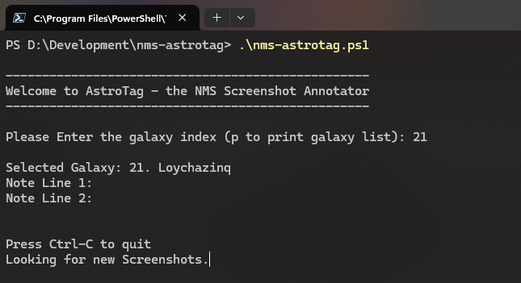
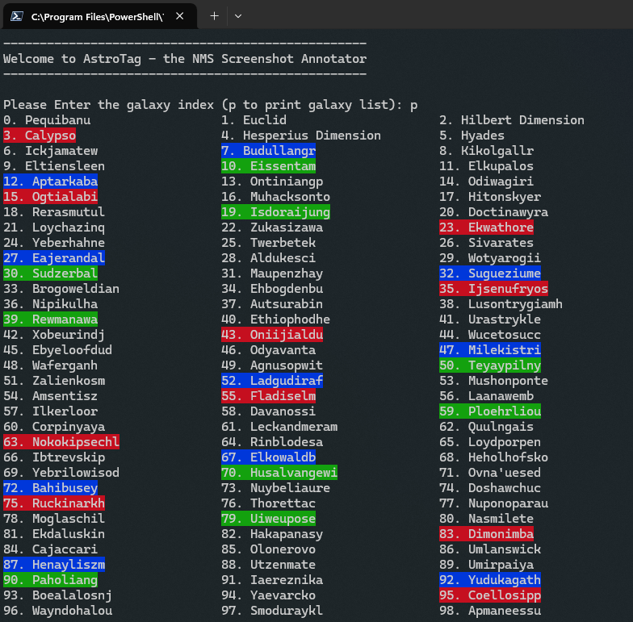
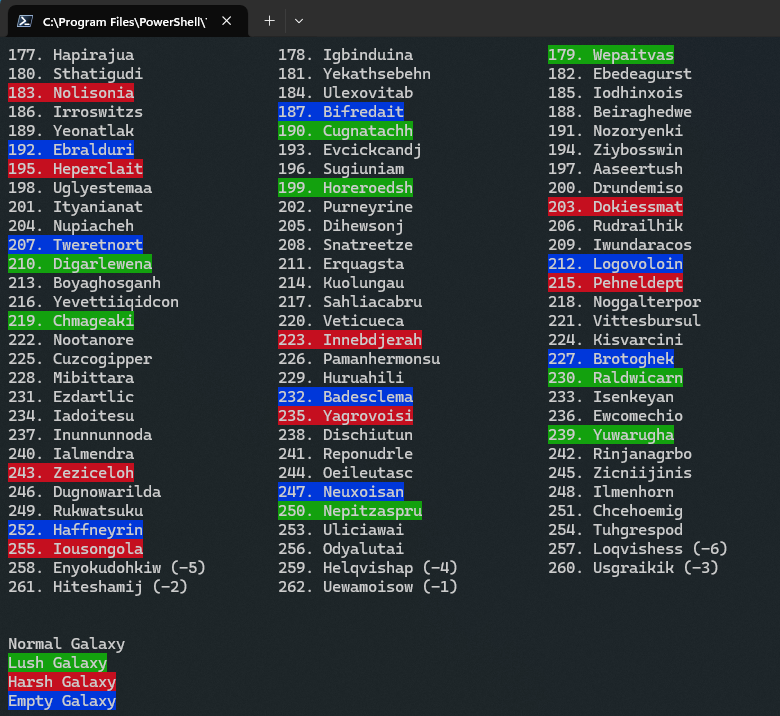
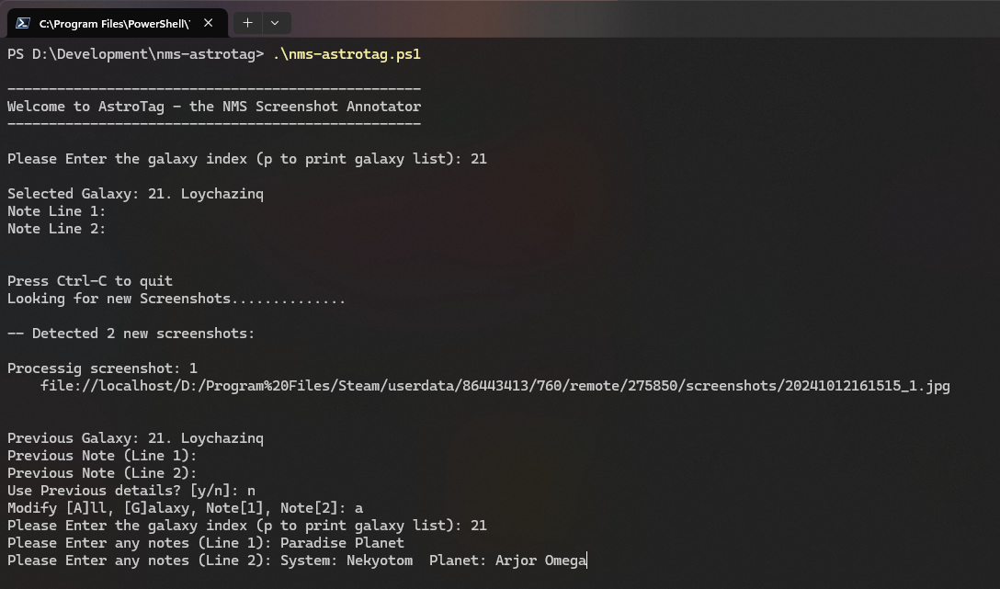

# AstroTag - the No Man's Sky Screenshot Annotator

Welcome to Quol's No Man's Sky screenshot annotater - AstroTag. 
The purpose of this tool is to annotate screenshots by overlaying information like galaxy name, player name, and notes to the screenshot to help catalog findings. It is recommended that you use Steam's F12 when capturing screenshots as this will capture the portal address, and then AstroTag overlays the other details. AstroTag will not touch the original screenshots, as all edits are performed on copies of the screenshots.

## how it works

This script will simply check the steam screenshot folder for any new screenshots, and then add the annotations to them and save the newly edited screenshot to a new directory. This way the original screenshot is not modified at all. By default, the annotated screenshots will be placed in an "annotated" folder in the same directory as your Steam screenshots using the same name as the original.

When you execute the script, the script will look for screenshots that have not been annotated, and ask you for the details applicable to each screenshot that you would like to overlay, such as galaxy name and some arbitrary note (optional). Galaxy names are entered using their numeric index corresponding to the NMS galaxy, and you can have AstroTag list all galaxies and lookup their corresponding index. 

## Galaxy Names
All 263 galaxie names are pre-entered. All you have to do is to select the corresponding ID. To see the full list, simply press P at "Enter Galaxy Index" prompt that is displayed when running the script. This will show you the full list. Find the Galaxy, and you will see the index. 

Examples:
* enter "1" for Euclid
* enter  "10" for Eissentam

## Requirements

* Windows 10 or 11
    * powershell (included in windows 10/11)
    * a powershell execution policy that allows you to run the script
        * Set-ExecutionPolicy Unrestricted (allows you to run all scripts - be carefull!)
        * call the script via the following command line:
            * powershell -ExecutionPolicy Bypass -File nms-astrotag.ps1
* ImageMagick
    * download from ImageMagick's site and install or use winget:
        * https://imagemagick.org/script/download.php
        * winget install ImageMagick.ImageMagick

## installation

Once you have ImageMagick installed, then all that is needed is to download a copy of this script, and place it anywhere you want on your computer. You can download by clicking on the "nms-astrotag.ps1" file above, and then selecting "download" from the "..." menu on the right.

Once downloaded, modify the following variables located at the top of the file (open in any text editor - like notepad or visual studio code):

### $screenShotPath
this should be set to the patch where steam places your screenshots when you press F12 in-game. if unsure where they are placed, in Steam click on one of your screenshots, and the Steam screenshot manager should open. Click on the little folder icon next to the game dropdown, and that should open the windows file explorer. Update the $screenShotPath varaiable with this location.

### $addPlayerName
set to $true to add your playername to the top right of your screenshots

### $playerName
set to your desired player name. this is the name that will be added to the top right corner of your screenshots

## usage

with the file downloaded and variables updated, all that is needed is to execute the script from a powershell console. Open a powershell console, navigate to the correct directory (hint: open the windows file explorer and browse to the folder where you placed the script and then type "powershell" in the navigation bar at the top. this will open powershell in the same directory that file explorer is displaying).

To execute the scipt, enter the following line and press enter:

* .\nms-astrotag.ps1

or you can just start typing "nms" and press your tab key, and the command auto-comlete should take care of the rest for you.

if you do not want to change the default execution policy to unrestricted, then you can still run this script with a command like:

* powershell -ExecutionPolicy Unrestricted -File .\nms-astrotag.ps1

this will cause astrotag to run in the background and locate un-annotated screenshots and prompt you for the correct information that should be overlayed per screenshot.

# Recommendations

It is recommended that you run this script within the new windows terminal which can be downloaded from the microsoft store. This way you can simply click on the screenshot links that AstroTag displays in the console for the image that is currently being processed. Clicking on the link in the windows terminal will open that particular screenshot up in your default image viewer so you can see which screenshot is about to be tagged. Then you can confirm the details and AstroTag will overlay the details and move to the next screenshot.

# Images
AstroTag will start the main loop upon startup and look for any new screenshots:

When a new screenshot is found, AstroTag displays the path tot he file, and it is clickable if you use the new Windows Terminal which will open up the screenshot in your defatul image viewer. This way you can see which screenshot will be annotated.

You need to confirm the galaxy ID to identify the galaxy. If multiple screenshots will be processed, then the galaxy ID will be reused (although you can change it if required):

Entering 'p' will list all 263 galaxies. You can use the console's scroll bars to browse through the list and identify the ID for your desired galaxy:

Enter the desired galaxy ID (such as 10 for Eissentam), and a note (if desired):

Before AstroTag overlays the information, you need to validate the input. Entering 'n' here will allow  you to change the galaxy ID and note:

And here is the result that is saved into the annotations directory:

